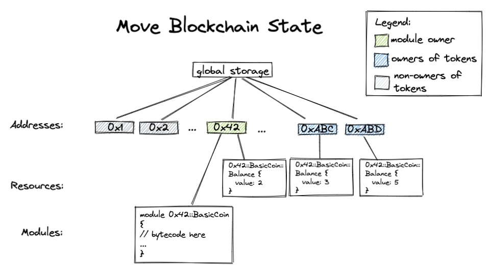
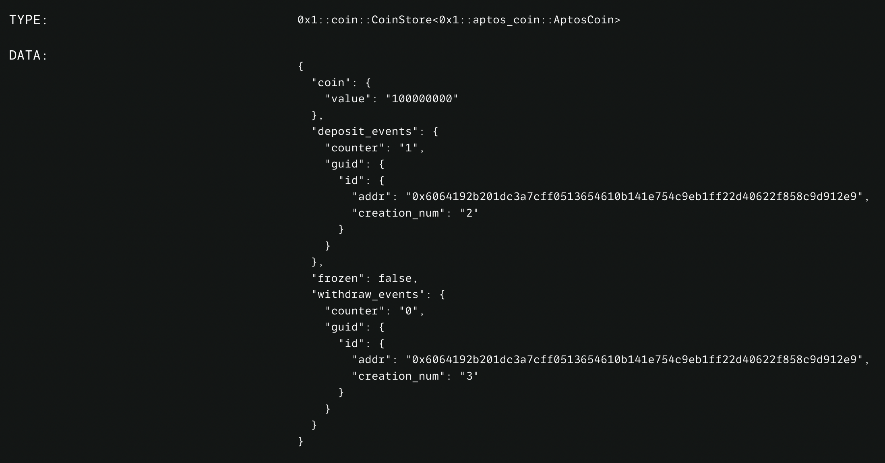
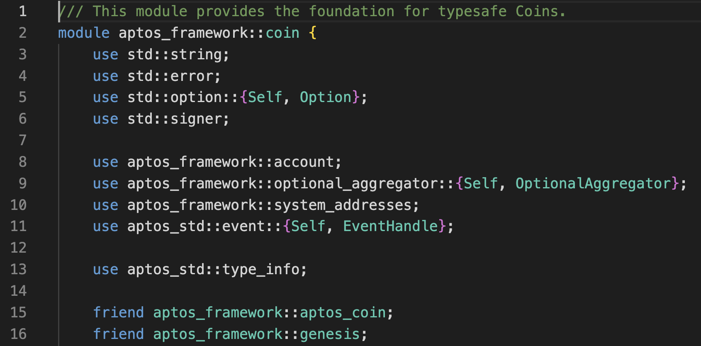
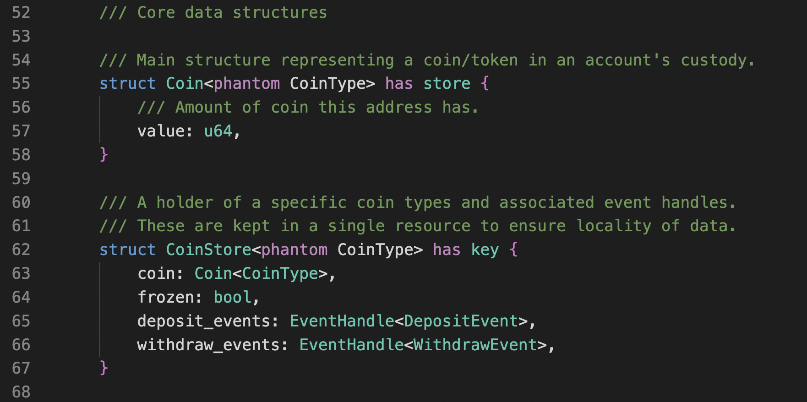
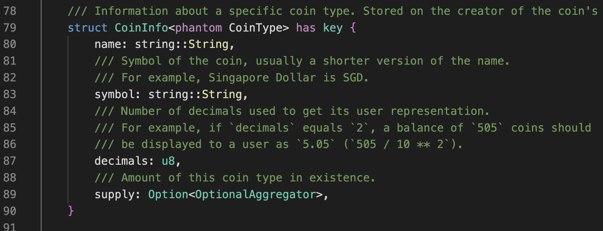
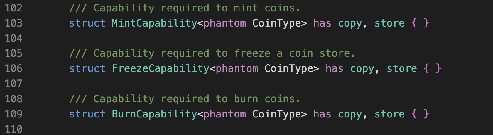
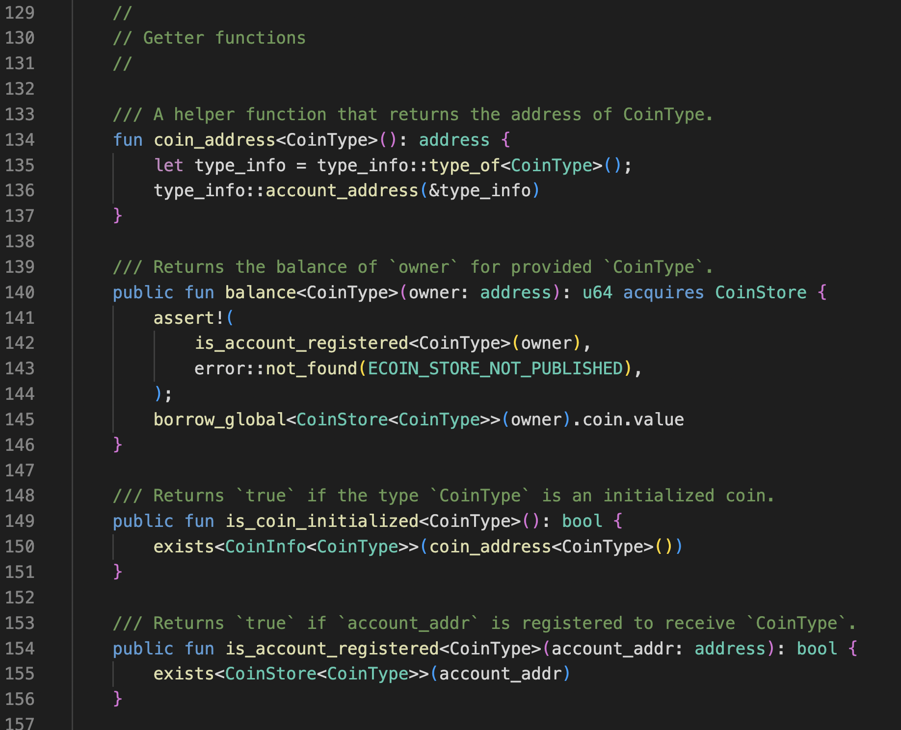
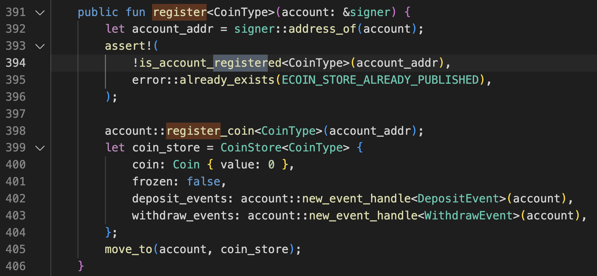
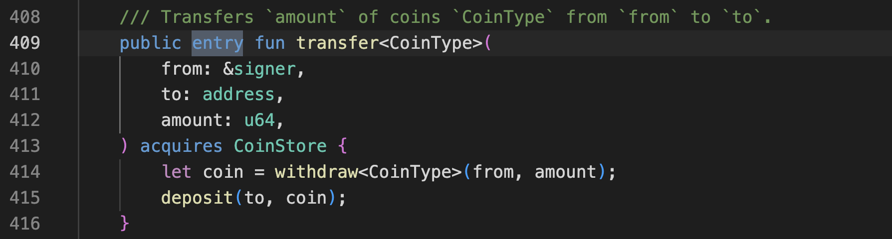

# Aptos 的 coin 模組

### 前言

因為個人的學習習慣，學習一個新的語言除了初步了解一些規則之後，最好的方式就是直接看一個實作例子。尤其像是 Move 這種特化語言，直接看他如何實作貨幣邏輯應該是最能表現 Move 特色的方式。

所以第一段會先簡介 Move 的資料結構以及基本規則。第二段則會觀摩 Aptos 的 coin 模組來更加深入了解 Move 語言。

### Move 資料結構

Move 的資料結構跟 Solidity 類似的樹狀結構，不同的是 Solidity 是以智能合約為主要檢索，所以你的資產其實是記錄在合約之下的。而 Move 的主要檢索是帳號，該帳號所部署的 Modules 和所擁有的 Resources 會儲存在該帳號之下。

### Modules 與 Resources

Modules 會定義兩種東西，這個模組會用到資料型別（struct）以及操作介面（function）。你可以給資料型別賦予四種能力（ability），分別是 key、store、copy、drop。

- key 表示這個型別可以存在帳號之下，也就是說，能成為 Resources。
- store 表示這是可以存在 ledger state 的資料，不是只是模組內部運算方便而定義的。
- copy 表示這個型別可以被複製。了解 Rust 的朋友應該都知道，在取用 struct 的時候會拿走所有權（ownership）。如果不想要拿走的話，可以借用（borrow）或是複製一份。所以 copy 確保了後者的可行性。
- drop 表示這個型別被取用之後，可以選擇不處理這個資料。這概念可能有點怪，在一般的程式語言裡，不處理變數並不會怎樣。但 Move 裡嚴格規定取用就一定要對他處理，不然就不要取，或是就借用就好。

Resources 是存在帳號之下的重要資源，不應該被複製，也不應該憑空消失。所以 Resources 可以被看成一種特別的 struct，定義的時候會賦予他 key，而且裡面所有的 field 都要 store 能力，最後是不應該有 copy 和 drop，確保不會被複製和憑空消失。

Modules 和 Resources 有強烈的從屬關係，只有定義了 Resources 型別的 Modules 才能操作該資源。所以如果別的模組需要動用別的模組定義的資源，也只能透過模組公開的操作介面。

所以要知道自己的資源是由哪個模組操控的，可以在 Explorer 上可以清楚看到

比如說 Aptos 的原生幣 AptosCoin 就會顯示他的型別是 0x1::aptos_coin::AptosCoin，解析就是 0x1 帳號之下的 aptos_coin 模組所定義的 AptosCoin 型別。不過這個型別並沒有賦予 key 能力，所以不能成為資源，他只提供一個種類。而這個型別可以作為 Generic 來使用，像是被 0x1::coin::CoinStore 使用。再複習一次，這是 0x1 帳號下 coin 模組所定義的 CoinStore 型別，紀錄帳號下某種 coin 的資產狀態。所以你的帳號下任何長得像 0x1::coin::CoinStore<?> 的資產都通用相同的邏輯，有一樣的行為，都定義在 0x1::coin 這個模組裡。

有個基本認識接下來就是 trace code 時間！會跳過一些較瑣碎或是較複雜的概念。

### Aptos 的 0x1::coin 模組

剛剛已經有稍稍提到這個模組，0x1 下的模組基本上就是標準模組庫的感覺，在啟動創世塊時就部署上去了，接下來要來細看裡面定義了什麼操作介面。

模組的開頭會宣告 module [帳號:模組名稱]，aptos_framework 會被轉成 0x1，這個 mapping 可以定義在 Move.toml 檔。如果要使用其他模組的類型或運算，可以用 use 來簡化程式碼，像是 use aptos_framework::account 就可以用 account 代替上面這串。

friend 可以給某些模組開特權，只有他們可以呼叫有標示 public(friend) 的函數。可以看到 atpos coin 是一個特別的幣，畢竟是原生幣。

接下來就是定義型別，Coin 裡面包了一個值 value，也就是持有多少。可以看到 struct 的定義後面有 has store，賦予他 store 的能力，但沒有賦予 key，所以你永遠不會看到你的帳號底下有 0x1::coin::Coin<?> 這樣的資源。

下面再定義了一個 CoinStore 的型別，並賦予他 key 能力，所以型別裡的每一個 field 都要有 store 能力。coin 就是剛剛定義過的 Coin 類型，如果剛剛沒有賦予 store 能力，就不能存在 CoinStore 這個資源裡。freeze 表示該帳戶的該幣種是否被凍結。Event 的部分會由 aptos_std::event 這個模組去處理，這個部分本章不會討論到。
另外可以看到，Generic 的部分有一個 phantom 的字樣，之所以會加註這個字，是因為根據能力的規則，除了 key 之外，struct 被賦予什麼能力，generic 的型別也必須有該能力。但這裡的 generic 其實沒有出現在任何 field 的定義裡，他只作為辨識，是一種 name tag 的概念，讓你可以區分 Coin\<A> 和 Coin\<B> 而已。所以加一個 phantom 告訴 compiler，這個 generic 只是一個 tag，不需要遵守能力規則。

CoinInfo 也是一個資源（有 has key），紀錄該幣種的 metadata，通常只會存在發幣者的帳號之下。

這裡定義了該幣的鑄造、凍結、燒毀的權限，都沒有 key 能力，發幣者可以自己定義想要存放的地方和如何使用。可以注意到權限的 copy 能力，這使得你可以給別人權限但還是能保有自己的權限。

定義完型別接著定義邏輯和操作介面。函數用 fun 定義，可以看到有的 fun 前面加了 public，代表這個函數可以被其他模組呼叫，而沒有 public 的 fun 只供內部使用。

- coin_address\<CoinType>(): address
給定某個泛型，回傳該泛型是由哪個帳號所定義的。回傳的型別會接在冒號後面，address 是 move 的內建型別。實作用到 aptos_std::type_info 這個模組去做轉換。

- balance\<CoinType>(address): u64
回傳給定的帳號地址持有有多少幣。注意 acquires 這個詞，後面接著的是這個函數會存取模組內的哪種資源。以 balance 為例，他要取出該帳號下面的 CoinStore\<CoinType> 裡的 coin 裡的 value，所以必須要 acqires CoinStore。而讀取資源使用的是 borrow_global\<T>(address)，這個內建函數會取出該帳號下型別為T的資源。借出之後挖出 value 應回傳。 assert! 會檢查條件是否為真，若否就中斷執行，回傳錯誤碼。檢查的條件是帳號是否有註冊該幣種，這個函數下面會會提到。

- is_coin_initialized\<CoinType>(): bool
回傳這個幣種有沒有初始化，實作方式是檢查有沒有發幣者帳號下有沒有 CoinInfo 資源。用到的是內建函數 exists<T>(address)，可以查看該帳號下有沒有T資源，所以應該在 borrow_global 之前都要呼叫 exists 來檢查。另外可以注意到，檢查帳號下存不存在某資源是不需要 acquires 的。

- is_account_register\<CoinType>(address): bool
回傳該帳號下是否 CoinStore\<CoinType> 的資源，在 balance 裡 borrow_global 前必須先做這個檢查。有趣的是，這個 coin 模組的設計是要先註冊，才能接收該幣，這樣避免收到一些空投垃圾幣。註冊的方式就是把 value 為 0 的 CoinStore\<CoinType> 資源塞到你的帳號底下，。

這就是申請該幣種帳號的函數。這裡第一次看到 signer 這個型別，表示這個操作是需要帳號的認證私鑰簽署的，避免隨便幫別人亂註冊垃圾幣。首先用 std::signer 模組裡的 address_of 把 signer 轉換成 address 型別，然後檢查是否註冊過，沒有的話就創建一個新的 CoinStore 資源，塞到 signer 的帳號底下。塞的方式就是用 move_to(signer, resources) 這個內建函數，這裡就可以看到 drop 這個能力的效果，因為沒有賦予 drop，所以創建出來的 CoinStore 必須處理。若刪掉 move_to 那行，是會編譯失敗的。

這是轉錢的函數，可以看到新的 entry 的字樣在 fun 之前。剛剛出現的函數只有 public，也就是給別的模組使用，而非可以透過交易（transaction）直接呼叫的。entry 就標示這個函數可以包到交易中呼叫，不是給其他模組呼叫的，Move 在這方面做了嚴格的區分。所以出金者可以根據 0x1::coin::transfer 這個函數創建交易，簽署之後交付節點驗證並執行，然後錢就轉出去了。至於實作的部分，是由另外兩 個coin 模組的函數去實作。
